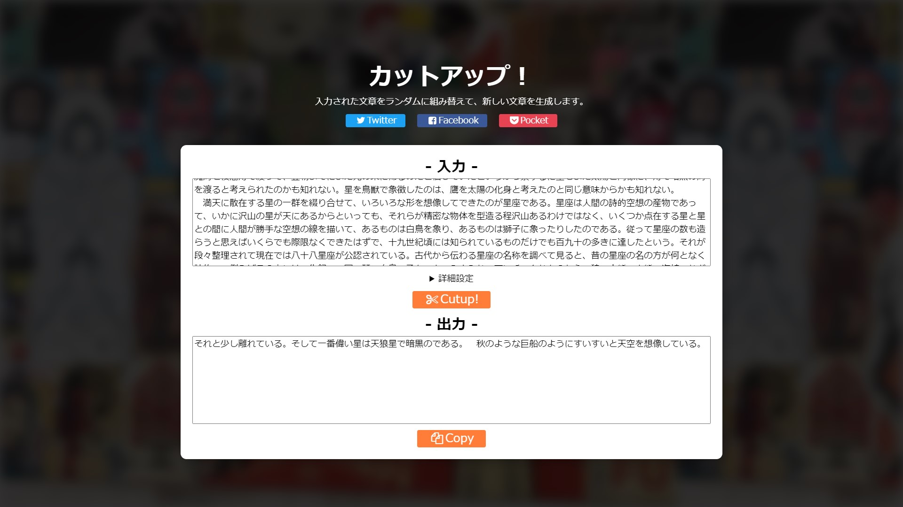

# cutup_jp

日本語の文章をカットアップする Web アプリケーション。

## カットアップとは？

カットアップとは、既存の文章をバラバラに組み替えて、新しい文章を生成する創作手法です。本アプリでは入力した文章を [一定のルール](https://www.12kai.com/cutup/cumaking03.html) で分割し、それらをランダムに組み合わせることで、新たな文章を簡単に生成することができます。

この手法は、過去に作成したノベルゲーム [めうちきりんのメトロポリス](https://github.com/ichi-h/myochikirin_no_metropolis) の文章生成に用いられています。

## 使い方

- 入力
  - カットアップする文章。
- 出力
  - カットアップの結果を表示。
- Cutup!
  - 入力された文章をカットアップする。
- Copy
  - 出力結果をクリップボードに保存する。
- 詳細設定
  - 文頭
    - カットアップによって生成される文章の文頭として用いる文字・記号。
  - 文末
    - カットアップによって生成される文章の文末として用いる文字・記号。
    - 文末で指定した文字・記号の次にある文字は、自動的に文頭として設定される。
  - 文中
    - カットアップをする際の区切り文字となるポイント。
  - 文の長さ
    - 下限
      - 生成される文章の最小の長さ。
    - 上限
      - 生成される文章の最大の長さ。
      - 下限よりも小さい値を指定することはできない。
      - 下限と上限の幅が狭い場合、文章が生成されない場合がある。

## 使用技術

- HTML
- JavaScript
  - MVU Architecture
- SCSS
  - SMACSS
- Other tools
  - Jest
  - parcel
  - prettier etc.

### MVU Architecture

cutup_jp は、**MVU Architecture** を採用しています。

MVU とは、"Model, View, Update" の略称であり、それぞれ以下のような役割を担っています。

- Model
  - アプリケーションの状態（ステート）
- View
  - Model を UI に反映
- Update
  - Model の更新

MVU Architecture では、クライアント側の何らかのアクションに応じて Model を更新し（Update）、その Model を UI に反映する（View）というサイクルの上でアプリケーションを構築します。

MVU Architecture を採用する代表的なフレームワーク（言語）として Elm が挙げられます。  
Elm では View の戻り値として仮想 DOM を用いることで、実際の UI（ReadDOM）とロジックを分離し、Elm 内の純粋性を保っています。

しかし、本アプリケーションでは仮想 DOM を扱わないため、どこかのタイミングで ReadDOM を直接参照し UI を更新するという非純粋なロジックを記述する必要があります。そのため本アプリでは、Model 関連したノードの参照は View 関数のみに制限し、他では行わないというルールの下でコーディングしました。

### SMACSS

CSS の設計手法として、**SMACSS (Scalable and Modular Architecture for CSS)** を採用しています。

SMACSS では、"Base, Layout, Module, State, Theme" という 5 つのカテゴリを用いてスタイルを構築します。

- Base
  - ページ全体に適用されるデフォルトのスタイル
- Layout
  - ページのレイアウトの決定（主要コンポーネントの構築）
- Module
  - ページ内の個別のコンポーネントの構築
- State
  - レイアウトやモジュールのスタイル拡張
- There
  - UI の見た目の上書き・変更

cutup_jp では Base で CSS のリセットや基本的なスタイルの決定、Layout でページのレイアウトの構築、Module で再利用可能なモジュールの作成、という意図で実装しています。State は必要となった Module と同じファイルに記述しています。  
また、現状では There は使用していません。

詳細は、[/src/assets/scss](https://github.com/ippee/cutup_jp/blob/main/src/assets/scss) の各ファイルをご覧ください。

## 参考

1. [Making cutup software](https://www.12kai.com/cutup/cumaking01.html)
2. [はじめに · An Introduction to Elm](https://guide.elm-lang.jp/)
3. [Pragmatic MVU With React And TypeScript](https://thomasbandt.com/model-view-update-with-react-and-typescript)
4. [フック API リファレンス – React](https://ja.reactjs.org/docs/hooks-reference.html#usereducer)
5. [Ja - Scalable and Modular Architecture for CSS](http://smacss.com/ja)
